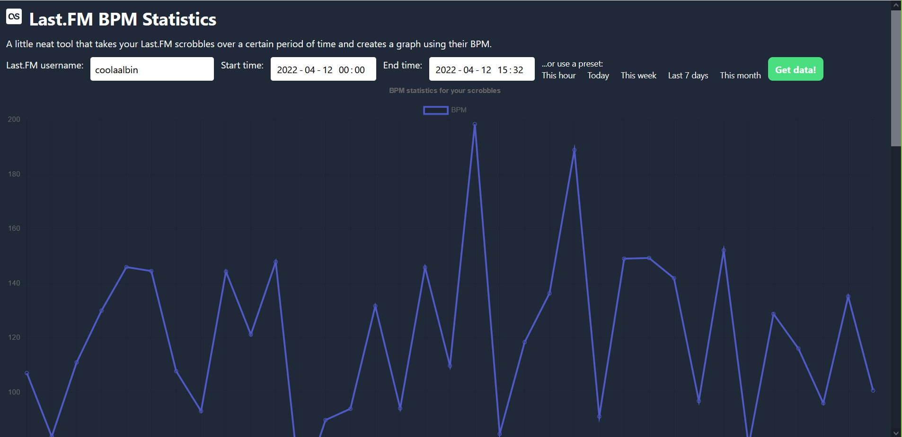
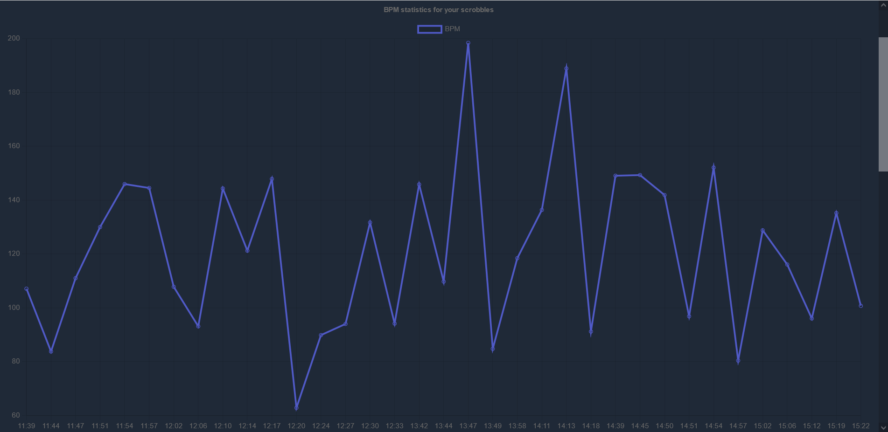
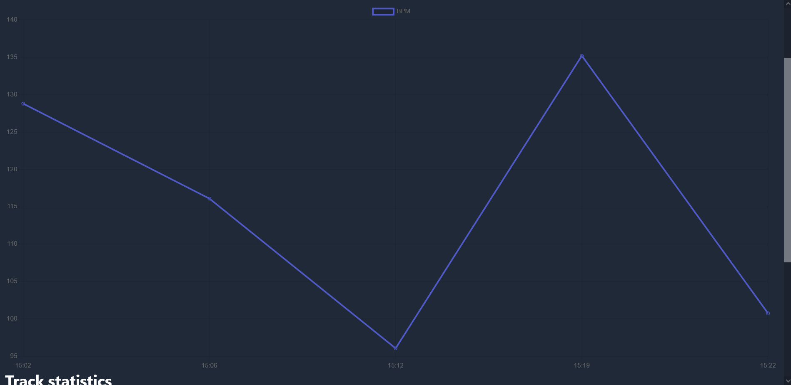
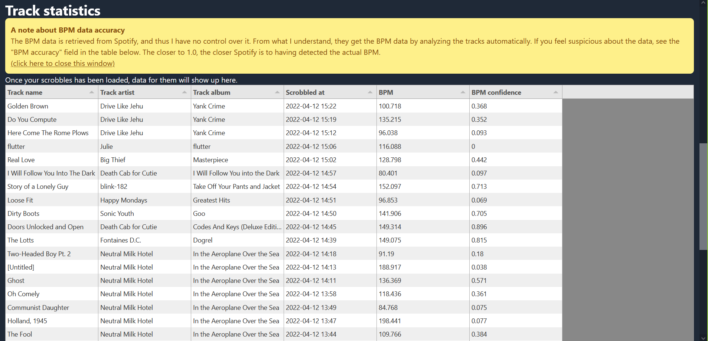
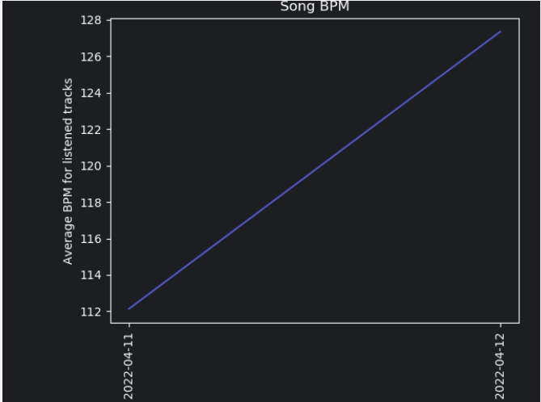

# Last.FMBPMStats

This repository contains code for a Javascript and Python implementation
of code that can take your Last.FM scrobbled tracks and compare their BPM over a certain period of time
(by plotting the BPM counts on a graph).

The Javascript implementation is a website and the Python implementation is a more "proof-of-concept" script.
The Python code also includes a minimal "for the purpose" Last.FM client.

### The website

> **ℹ Note:** A hosted version is available at http://lfmbpm.sweetpotato.online

> **ℹ Note:** The clients used in the websites can be found [here](https://github.com/fxb/javascript-last.fm-api) (Last.FM) and [here](https://github.com/JMPerez/spotify-web-api-js) (Spotify).

The website is ready to go. Just download the clients and you can deploy it anywhere.

Please fill out your own credentials though. Here is some code to do that:
```javascript
// Set up clients
let spotify_client_id = "<details here>"
let spotify_client_secret = "<details here>"
let last_fm_api_key = "<details here>"
let last_fm_api_secret = "<details here>"
```
(the client details are defined in an obfuscated JavaScript string in the original code)

> **⚠ Please note:** Remember that API credentials in JavaScript (which is what the website uses)
> can be sniffed. Therefore, I recommend that you use throwaway credentials for any production applications
> in case anyone decides to use your credentials for something bad.
> This project does not use a super clean way to handle credentials, I know. It is nothing I would do professionally.

##### Example outputs & screenshots of the website:





### The Python script

The Python script is more of a proof of concept. The image saving doesn't
really work properly, but the rest of the code does. You can change the start
and end time by editing the variables named
`start_time` and `end_time`. Edit the Last.FM username by editing the variable `last_fm_username`
in the script.

##### Example outputs of the Python script:

